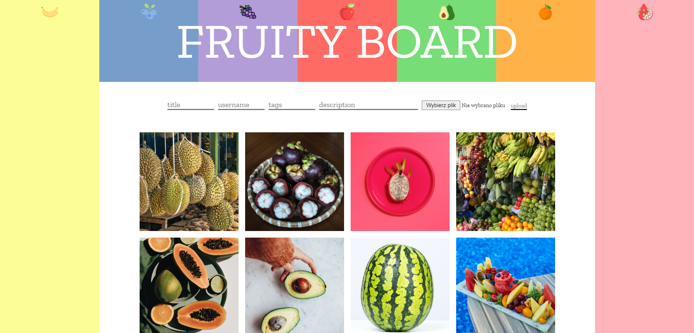
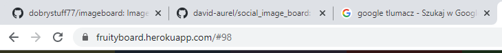
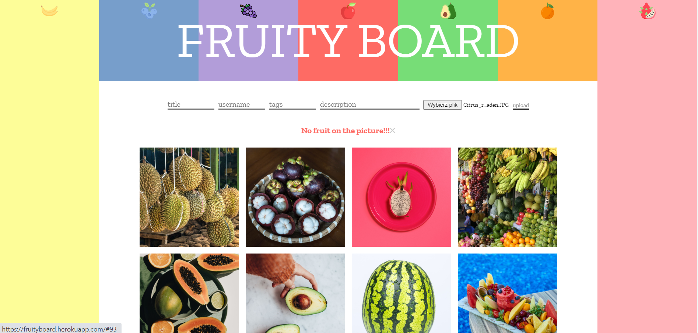
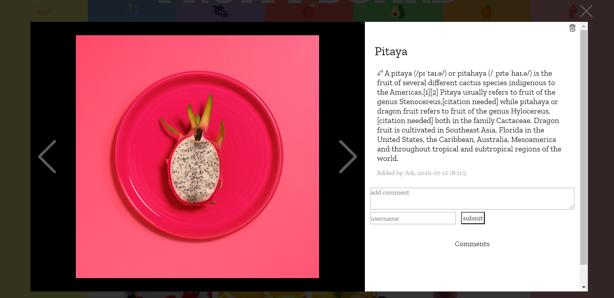

### Fruity Board

In this project I used Vue.js for the first time. I can't hide that because it was one of mine first project I was super excited. Inspiration came with love for colors, taste and beautiful symmetrical patterns of fruits. Main conception was to give opportunity to just share images where is at least one visible random fruit. Uploaded Pictures are filtered with help of the Google API, pictures without fruits are rejected. Uploading pictures you can add: title, author, tags and description.

---

### Frontend

To build a frontend I used just pure HTML/CSS.

---

To navigate to different sites I'm using Hash-Routing, so selected picture can be send to someone with URL.

---

### Backend

Backend was build with PostgreSQL for database and Node.js with Express server for the rest.
Uploaded pictures are sent to AWS S3, in database are stored only URLs.
When the picture is rejected you can see the message.

---

### Interaction

Click on the picture to make picture bigger and read comments. Now you can add comments using your own nick :)
You can also navigate through pictures using left and right arrows and X for closing the modal.

---

---
